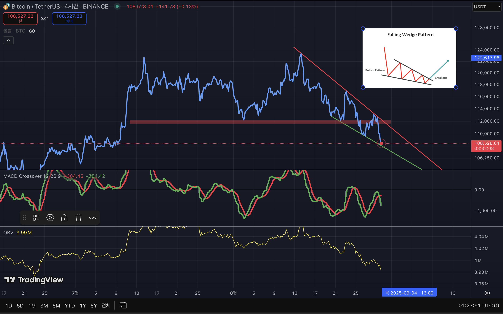

# 2025-08-30_Falling_Wedge_OBV.md

## Objectives  

1. Enhance risk management and strategic decision-making skills under uncertainty  
2. Strengthen deductive, data-driven reasoning by eliminating intuition and emotional bias  
3. Establish a probabilistic thinking framework with consistency and predictive reliability  
4. Study behavioral patterns and decision-making processes of individuals and institutions through market analysis  
5. Advance economic insight and structural understanding  

For me, success isn’t about doing well on my own—it’s about walking a path where we all thrive together

## Chart Analysis: Falling Wedge with OBV & Elliott Wave Context

---

### 1. Current Observation
- **Pattern:** Falling Wedge (potential bullish reversal pattern)  
- **OBV (On-Balance Volume):** Continuously declining → mid-to-long term bearish signal  
- **However:** Short-term reversal potential exists at this level.  
- **Key Conditions:**  
  - Bounce above the green trendline (support) → short-term reversal possible  
  - Breakdown below the green trendline → risk of Elliott Wave **3-3 downward wave**  

---

### 2. Interpretation
- **Bullish Scenario (Reversal):**  
  Due to the nature of the Falling Wedge, a breakout above the upper resistance line could serve as a strong bullish reversal signal.  

- **Bearish Scenario (Further Decline):**  
  If the price closes below the support trendline, it may trigger an Elliott Wave 3-3 decline, leading to a sharp drop.  

- **Conclusion:**  
  This zone is a critical **inflection point**, and any trading decision should involve a clearly defined stop-loss line.  

---

### 3. Indicators & Confirmation
- **MACD:** Currently in a correction phase → reversal signals are still weak.  
- **OBV:** Volume-based indicator shows strong downward pressure.  
- **Overall:** Short-term bounce possible, but structurally the risk of sustained bearish continuation remains high.  

---

### 4. References
- Bulkowski, T. N. (2018). *Chart Patterns: After the Buy*. Iremedia.  
- Frost, A. J., & Prechter, R. R. (2011). *Elliott Wave Principle: Key to Market Behavior*. Iremedia.  
- Dormeier, Buff. *Investing with Volume Analysis: Identify, Follow, and Profit from Trends*. FT Press, 2013.  

### 5. Result

