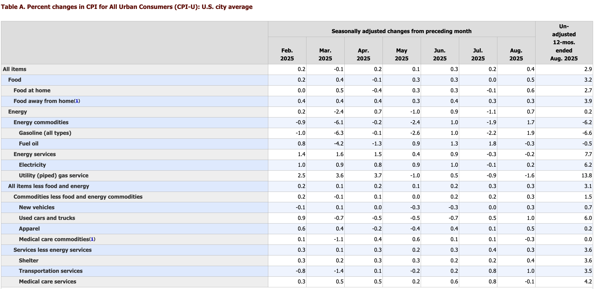

# US Consumer Price Index (CPI) – August 2025 Report

## What is CPI?
- **Consumer Price Index (CPI)** measures the average change over time in the prices paid by urban consumers for a basket of goods and services.  
- It is one of the most widely used indicators of **inflation**, reflecting purchasing power, cost of living, and economic stability.  
- The Federal Reserve and policymakers track CPI to guide **monetary policy**, particularly interest rate decisions.  

---

## How to Approach CPI
1. **Headline CPI (YoY, MoM):** Overall inflation including food and energy.  
2. **Core CPI (YoY, MoM):** Excludes food and energy due to their volatility.  
3. **Category Drivers:** Identifying which sectors (e.g., shelter, energy, food) drive the monthly changes.  
4. **Policy Implications:** Understanding how CPI trends influence central bank decisions (rate hikes/cuts).  

---

## CPI Trend (YoY)

- CPI peaked in 2022 at ~9% during post-pandemic supply shocks.  
- Since then, inflation has cooled but remains above the Fed’s 2% target.  
- August 2025 CPI came in at **2.9% YoY**, aligned with market expectations, up from **2.7% in July**.  

---

## Category Highlights – August 2025

- **Food:** +3.2% YoY. "Food away from home" remains elevated at +3.9%.  
- **Energy:** Still volatile; gasoline rebounded (+1.9% MoM) but YoY remains negative (-6.6%).  
- **Shelter:** +3.6% YoY, continues to be the largest driver of sticky inflation.  
- **Utility gas service:** +13.8% YoY, strongest category increase.  

---

## Key Insights
- Inflationary pressure is concentrated in **shelter and services**.  
- Energy components are stabilizing but remain unpredictable.  
- Core CPI remains elevated (~3.1% YoY), signaling persistent inflation.  

---

## Policy Outlook
- The Federal Reserve is unlikely to cut rates until inflation trends closer to 2%.  
- Market reaction is muted as CPI matched expectations (2.9%).  
- Continued focus will be on shelter costs and service sector inflation as indicators of future stickiness.  

---

## My reflection
The latest CPI release is expected to play a significant role in shaping the Federal Reserve’s decision on the benchmark interest rate at the upcoming FOMC meeting on September 17.
Politically, President Trump has signaled a preference for lower rates to bolster approval ratings, but the FOMC, as an independent institution, bases its decisions on economic conditions. Among these indicators, CPI remains one of the most critical references.

The current CPI figure came in broadly in line with market expectations, suggesting that monetary policy direction will not face undue disruption. Notably, while housing costs still represent a large portion of the index, the pace of increase has slowed, indicating that inflationary pressures are gradually easing.

In conclusion, this CPI report provides evidence that the Fed can maintain policy consistency within a normal range of responses. Regardless of whether rates are cut or held, the data supports the view that the Federal Reserve has sufficient grounds to proceed with measured and balanced action.

## References
- U.S. Bureau of Labor Statistics (BLS), *Consumer Price Index Summary – August 2025*  
- Investing.com CPI Data, September 2025  
