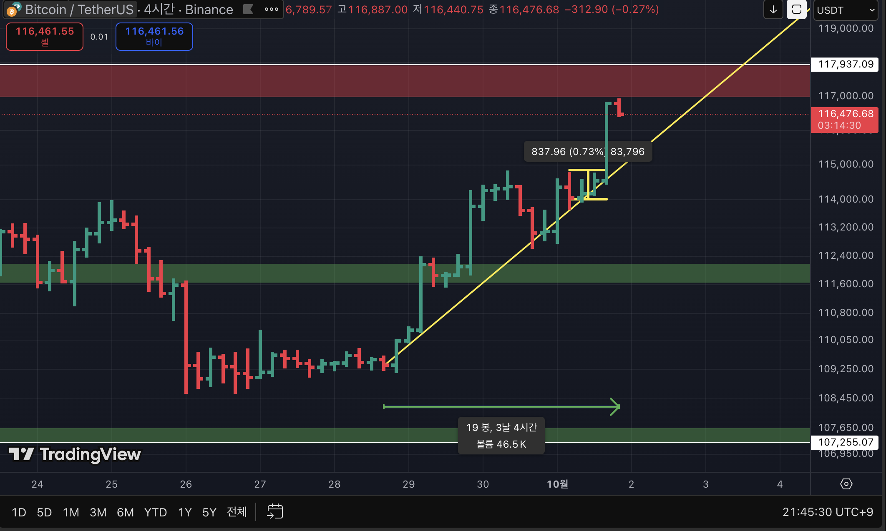
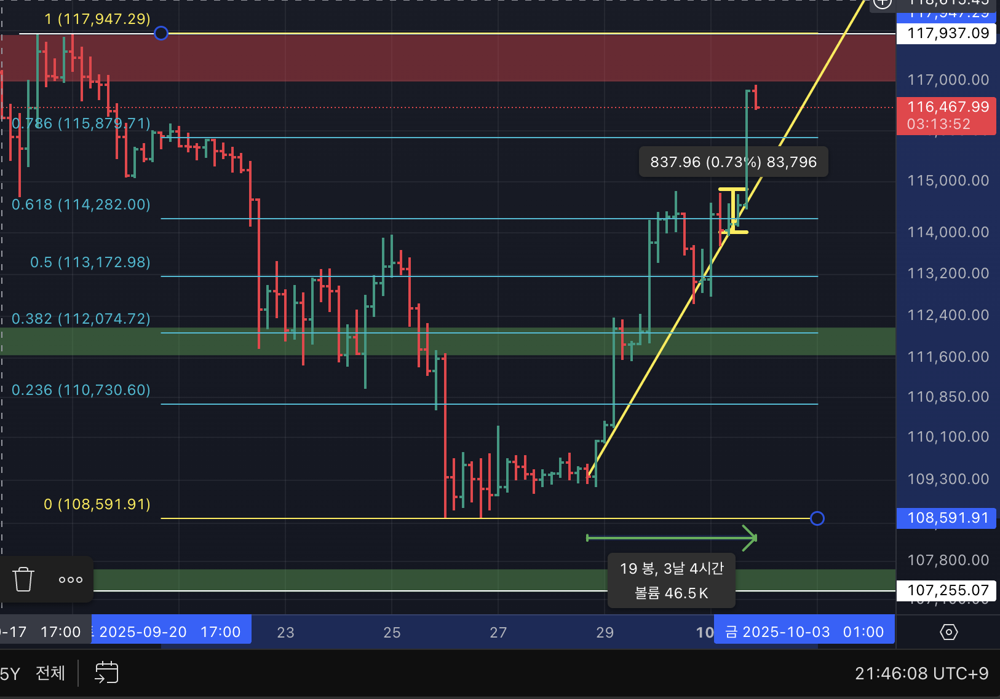

# Trade Reflection – Bitcoin (4H Chart)

  
  

## 📊 Result
- **-5.4% Stop Loss**  
- Risk managed by setting the stop loss at the **previous swing high**
---

## Entry Rationale
1. Attempted entry based on the **0.618 Fibonacci level**, interpreting it as a **C-3-2 wave**.  
2. Expected **MACD histogram contraction** (though it did not actually occur at the time).  
3. Predicted a **Double Top (M-shape) pattern** would form.  

---

## Mistakes to Reflect On
1. **Fibonacci**: Useful for large institutional players who scale in gradually, but less practical for individuals (hard to execute proper scaling).  
2. **MACD**: Acted only on **expectation** of a divergence/turn without confirmation.  
3. **Pattern prediction**: Entered before the **Double Top pattern** was confirmed.  

---

## Corrective Actions
1. Do **not** use Fibonacci as the **primary entry reason**.  
2. Always wait for **candle close confirmation** before entering.  
3. Confirm **MACD crossover or turn** before making a decision.  
4. Only enter **after a chart pattern is fully formed**, not during speculation.  

---

## 📝 Key Takeaway
Discipline means reacting to **confirmed signals** rather than predicting unformed ones.  
Trading should be based on **evidence**, not assumption.
