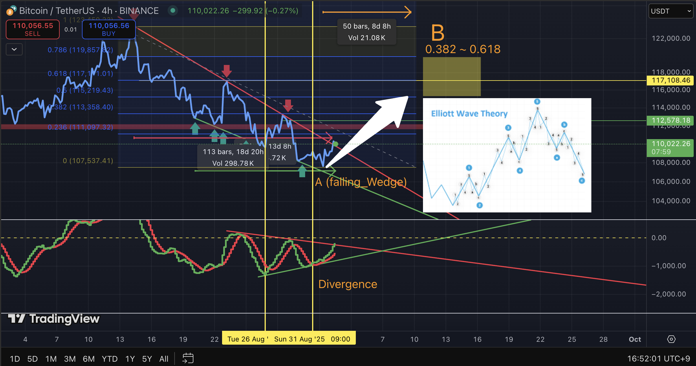
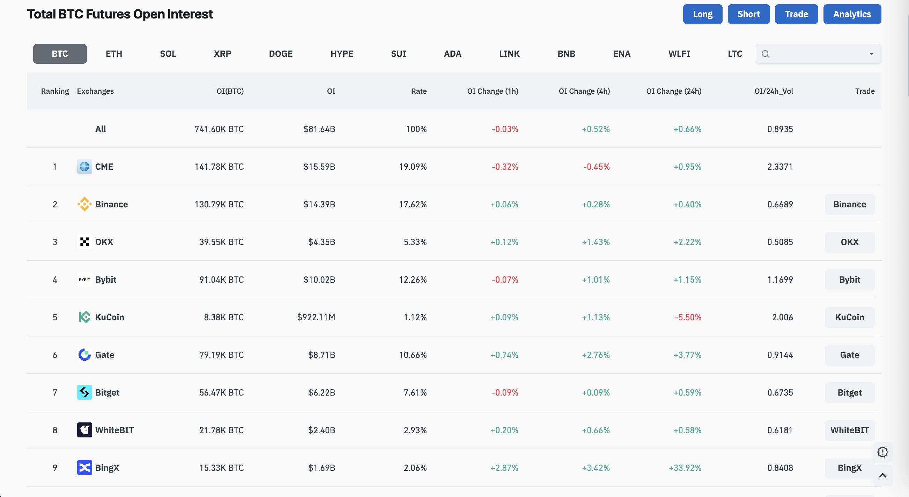
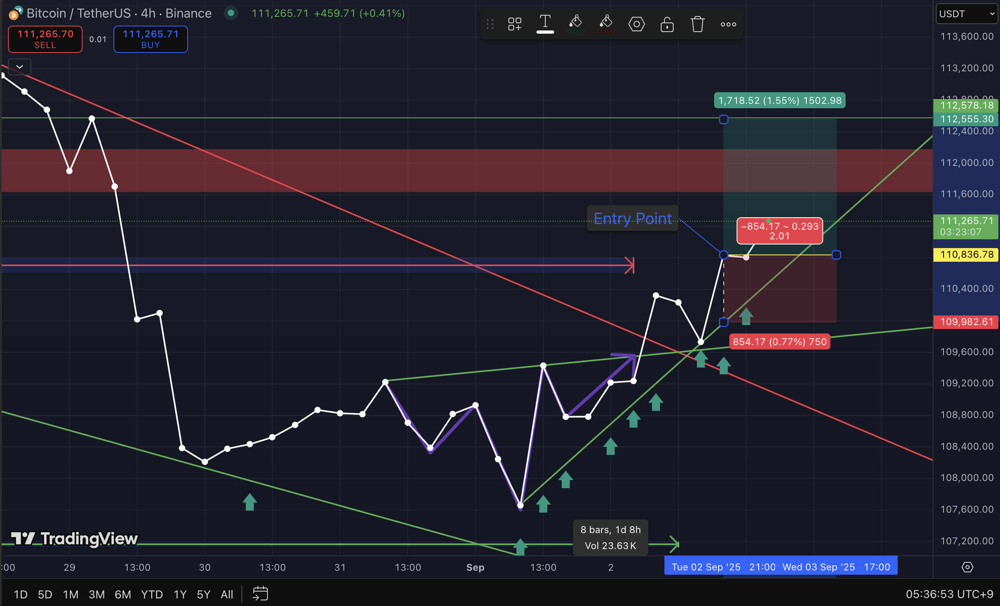
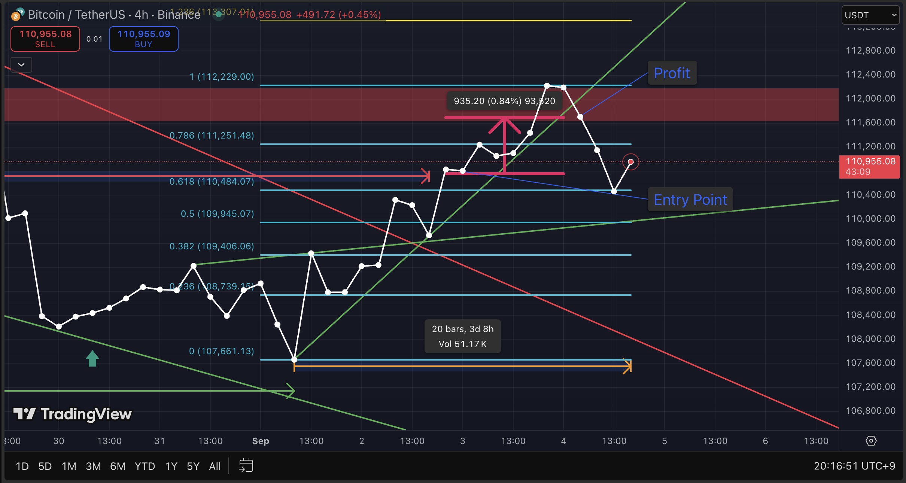

# 2025-09-02_Elliott_B_Wedge_OBV.md

## Chart Analysis: Elliott Wave B with Falling Wedge, MACD Divergence & OI Context

---

### 1. Current Observation
- **Pattern:**  
  - 5-step staircase decline → formation of a **Falling Wedge**  
  - Breakout above resistance trendline → potential start of Wave B in Elliott Wave context  

- **MACD (4H):**  
  - Clear **bullish divergence** observed → weakening downward momentum  

- **Open Interest (OI):**  
  - CME institutional OI showing **increased long exposure**  
  - Suggests institutional positioning is aligned with upward bias  

---

### 2. Interpretation
- **Bullish Scenario (Wave B Uptrend):**  
  - Breakout above wedge + divergence confirmation  
  - Potential retracement toward **0.382 ~ 0.618 Fibonacci zone** (≈ 113.3K ~ 117K)  

- **Bearish Scenario (Invalidation):**  
  - Failure to hold wedge breakout  
  - Breakdown back under green trendline → risk of Elliott Wave **3-3 downward wave** continuation  

- **Conclusion:**  
  This area represents a **critical inflection zone**:  
  - High probability of a corrective **Wave B rebound**  
  - But risk remains if breakdown occurs → stop-loss must be clearly managed  

---

### 3. Indicators & Confirmation
- **MACD:** Bullish divergence, momentum reversal signals gaining traction  
- **OBV:** Still structurally weak, but showing early stabilization signs  
- **OI:** CME-driven long positions suggest institutional confidence in rebound  

---

### 4. References
- Frost, A. J., & Prechter, R. R. (2011). *Elliott Wave Principle: Key to Market Behavior*. Iremedia.  
- Bulkowski, T. N. (2018). *Chart Patterns: After the Buy*. Iremedia.  
- Site: [Coinglass Bitcoin OI](https://www.coinglass.com/BitcoinOpenInterest)  

---

### 5. Result

  
  

