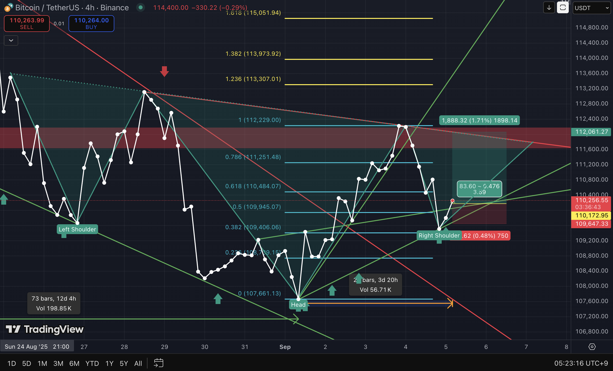

# 2025-09-05_Trade_Setup.md

## Chart Analysis: Elliott Wave Retracement, Fibonacci 0.382 & Inverse Head and Shoulders

---

### 1. Current Observation
- **Elliott Wave B Retracement**:  
  - Current move aligns with **0.382 Fibonacci retracement** level of Wave B (relative to the previous peak).  
- **Candle Count**:  
  - Over **23 bars** formed, providing structural confirmation of the pattern.  
- **Inverse Head & Shoulders**:  
  - Clear formation with left shoulder, head, and right shoulder, supporting a potential bullish reversal.  

---

### 2. Risk Assessment
- **Stop-Loss**:  
  - Defined at recent structural low, representing a controlled downside risk of approx **0.48%**.  
- **Reward Potential**:  
  - Breakout above neckline provides favorable R/R setup if confirmed by volume.  

---

### 3. Indicators & Confirmation
- **Fibonacci Retracement**: 0.382 level respected, aligning with corrective B wave structure.  
- **Chart Pattern**: Inverse Head & Shoulders adds confluence to bullish bias.  
- **Timeframe**: 4H chart with sufficient bar development (23+ bars), reducing noise and false breakout risk.  

---

### 4. Conclusion
This setup presents a **low-risk, high-probability trade opportunity**:  
- Confluence of Fibonacci retracement, Elliott Wave corrective structure, and inverse head-and-shoulders pattern.  
- Risk tightly defined (~0.48%), with asymmetric upside potential if neckline breakout occurs.  
- **Primary Bias**: Bullish reversal expected if neckline is broken with volume confirmation.  
- **Uncertainty Factors**:  
  - Breakdown below **0.382 retracement** may shift pattern into a potential **Double Bottom** formation.  
  - In such case, the **original view is invalidated**, requiring flexibility in strategy.  
- **Variable Leverage**:  
  - If upward momentum strengthens within the trendline, **leverage scaling from 5x to 10x** may be applied for amplification.  

---

### 5. References
- Frost, A. J., & Prechter, R. R. (2011). *Elliott Wave Principle: Key to Market Behavior*. Iremedia.  
- Bulkowski, T. N. (2018). *Chart Patterns: After the Buy*. Iremedia.

---

### 6. Result
