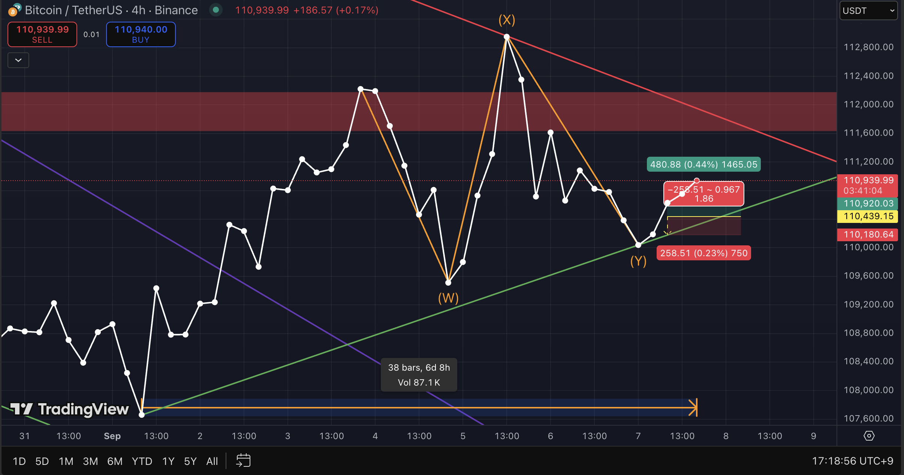
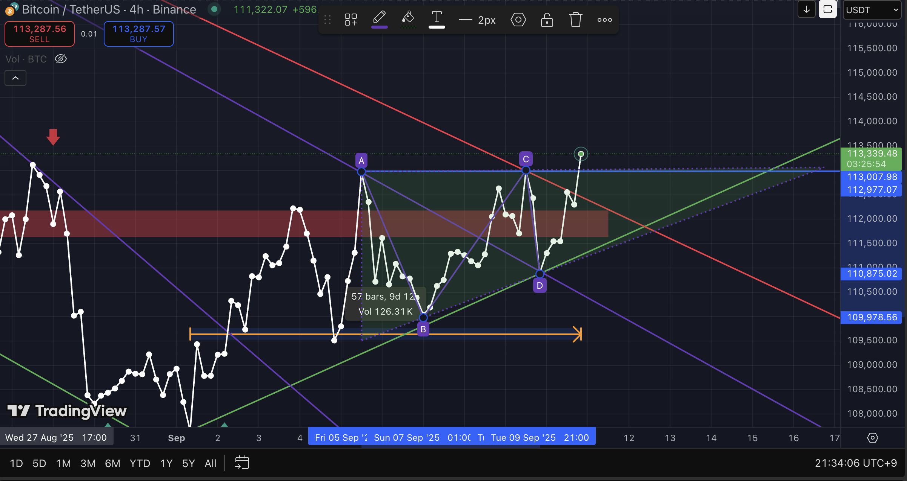

# 2025-09-07_Double_Three_Analysis.md  

## Objectives  

1. Enhance risk management and strategic decision-making skills under uncertainty  
2. Strengthen deductive, data-driven reasoning by eliminating intuition and emotional bias  
3. Establish a probabilistic thinking framework with consistency and predictive reliability  
4. Study behavioral patterns and decision-making processes of individuals and institutions through market analysis  
5. Advance economic insight and structural understanding  

## Chart Analysis: Double Three (W–X–Y) Corrective Pattern within ABC  

---

### 1. Pattern Structure Overview
- **Type**: Double Three (W–X–Y) within a larger **ABC corrective sequence (B-wave)**.  
- **Subdivision**: 3–3–3 corrective sequence.  
- **Key Rules & Notes**:  
  - **Wave X** typically retraces 50% ~ 61.8% of Wave W.  
  - In this case, **Wave X extended up to ~127%**, which is allowed under Elliott’s guideline for expanded structures.  
  - **Wave Y** often matches or slightly exceeds the length of Wave W (100% ~ 127.2%).  

  

---

### 2. Current Market Observation
- BTC/USDT 4H chart shows **B-wave unfolding as a Flat correction**, with its internal leg forming a **W–X–Y sequence**.  
- **Wave W**: Completed with a Zigzag-type or Flat move.  
- **Wave X**: Expanded rebound, reaching ~127% of Wave W (stronger than typical retracement).  
- **Wave Y**: Currently developing, with the potential to project to the same length as Wave W or beyond.  

  

---

### 3. Trading Implications
- **Bullish Scenario**:  
  - If Wave Y terminates near the 100–127% projection of Wave W, the corrective B-wave may complete, allowing a new upward impulse (C-wave).  
- **Bearish Scenario**:  
  - Breakdown below Wave W baseline invalidates the corrective structure and signals potential continuation of broader downside (failure of B).  

---

### 4. Risk Management
- Stop-loss should be defined **below Wave W termination**, the invalidation point for the Double Three.  
- Current R/Risk(between **0.18–0.25%**) setup ranges 
- Furthermore, the current structure may not end as a simple Double Three (W–X–Y), but could also extend into a Triple Three (W–X–Y–X–Z) pattern.

---

### 5. Conclusion
- The current correction phase is best interpreted as a **B-wave Flat containing a W–X–Y sequence**.  
- The **127% X-wave extension** signals an **expanded corrective formation**, not a simple Zigzag.  
- **Key takeaway**: Traders should avoid emotional bias and instead focus on **rule-based structure recognition and disciplined risk control**.  

---

### 6. Result

1. **Partial Profit Taken**  
   - Closed 50% position at **+1.21%** gain (Rate: 1:5 )

2. **Target Projection**  
   - Next target: **0.618 Fibonacci retracement level**, identified as the top of wave **B (abc)**.  
   - Expected profit: **+5.92%**.  

3. **Risk Management**  
   - Remaining 50% position held until trendline break.  
   - Stop condition: close below trendline.  
   - **Current maximum downside risk: -0.3%**.  

### 7. Reassessment (10-09-2025)
  
  

- The **lows are rising** while forming a triangular consolidation.  
- Structure shows a clear **ABCD triangle** with converging support (ascending) and resistance (descending) lines.  
- This consolidation often precedes a breakout aligned with the **previous major trend**.  
- The triangle indicates **accumulation before continuation**.  
- Primary target: **0.5 Fibonacci retracement** level.  
- Extended target: **0.618 Fibonacci retracement** level.  

## Risk
- Risk management should be based on **trendline invalidation** below point D.  
- Bias remains bullish unless breakdown invalidates the ascending structure.  

### 8. Result (12-09-2025)

  
- **Total Profit**: +3.9%  
- Closed all positions as the price approached the **0.5–0.618 Fibonacci retracement zone**, which often signals potential reversal or strong market reaction.  

### References
- Frost, A. J., & Prechter, R. R. (2011). *Elliott Wave Principle: Key to Market Behavior*. Iremedia.  
- Bulkowski, T. N. (2018). *Chart Patterns: After the Buy*. Iremedia.  
