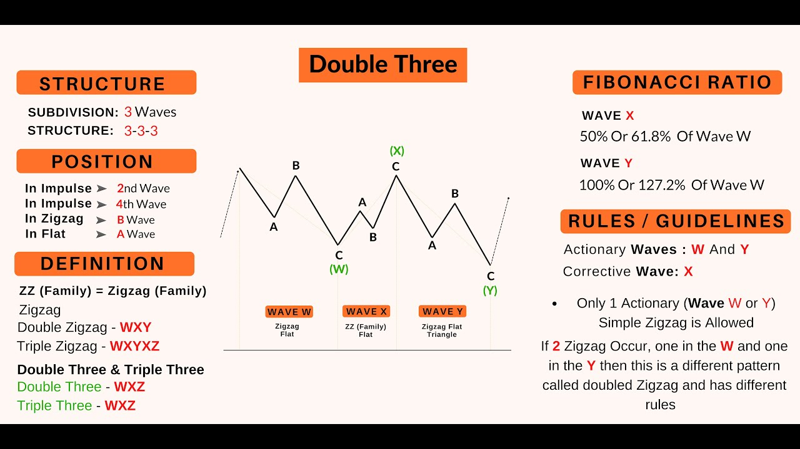
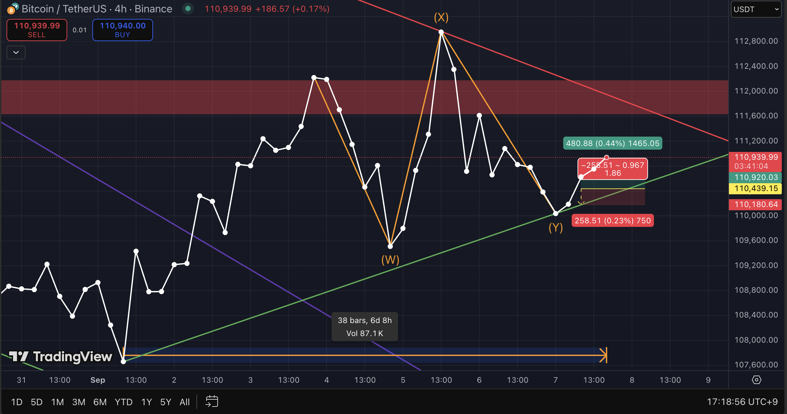

# 2025-09-07_Double_Three_Analysis.md  

## Chart Analysis: Double Three (W–X–Y) Corrective Pattern within ABC  

---

### 1. Pattern Structure Overview
- **Type**: Double Three (W–X–Y) within a larger **ABC corrective sequence (B-wave)**.  
- **Subdivision**: 3–3–3 corrective sequence.  
- **Key Rules & Notes**:  
  - **Wave X** typically retraces 50% ~ 61.8% of Wave W.  
  - In this case, **Wave X extended up to ~127%**, which is allowed under Elliott’s guideline for expanded structures.  
  - **Wave Y** often matches or slightly exceeds the length of Wave W (100% ~ 127.2%).  

  

---

### 2. Current Market Observation
- BTC/USDT 4H chart shows **B-wave unfolding as a Flat correction**, with its internal leg forming a **W–X–Y sequence**.  
- **Wave W**: Completed with a Zigzag-type move.  
- **Wave X**: Expanded rebound, reaching ~127% of Wave W (stronger than typical retracement).  
- **Wave Y**: Currently developing, with the potential to project to the same length as Wave W or beyond.  

  

---

### 3. Trading Implications
- **Bullish Scenario**:  
  - If Wave Y terminates near the 100–127% projection of Wave W, the corrective B-wave may complete, allowing a new upward impulse (C-wave).  
- **Bearish Scenario**:  
  - Breakdown below Wave W baseline invalidates the corrective structure and signals potential continuation of broader downside (failure of B).  

---

### 4. Risk Management
- Stop-loss should be defined **below Wave W termination**, the invalidation point for the Double Three.  
- Current R/Risk(between **0.18–0.25%**) setup ranges 

---

### 5. Conclusion
- The current correction phase is best interpreted as a **B-wave Flat containing a W–X–Y sequence**.  
- The **127% X-wave extension** signals an **expanded corrective formation**, not a simple Zigzag.  
- **Key takeaway**: Traders should avoid emotional bias and instead focus on **rule-based structure recognition and disciplined risk control**.  

---

### References
- Frost, A. J., & Prechter, R. R. (2011). *Elliott Wave Principle: Key to Market Behavior*. Iremedia.  
- Bulkowski, T. N. (2018). *Chart Patterns: After the Buy*. Iremedia.  
