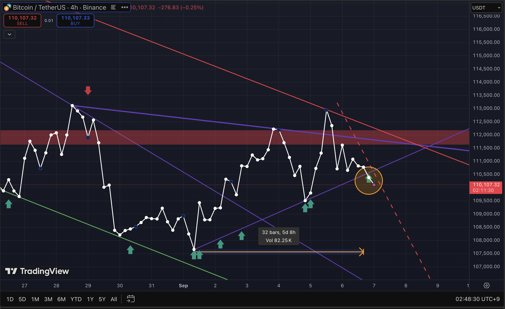
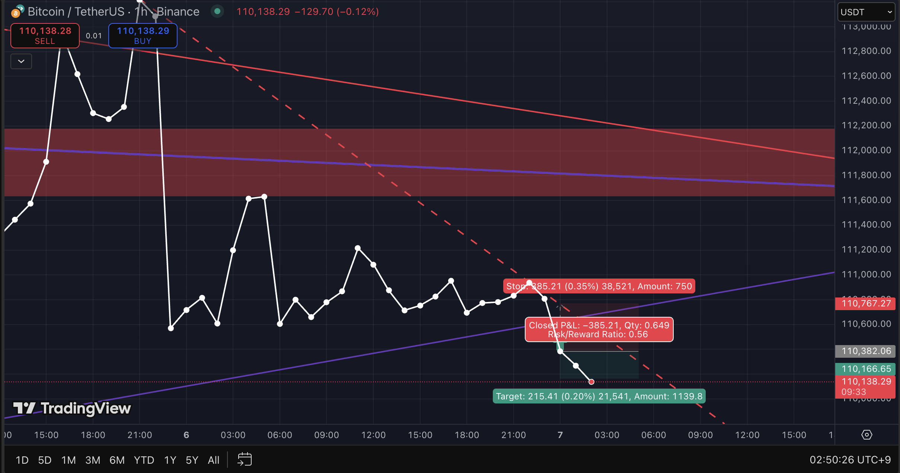
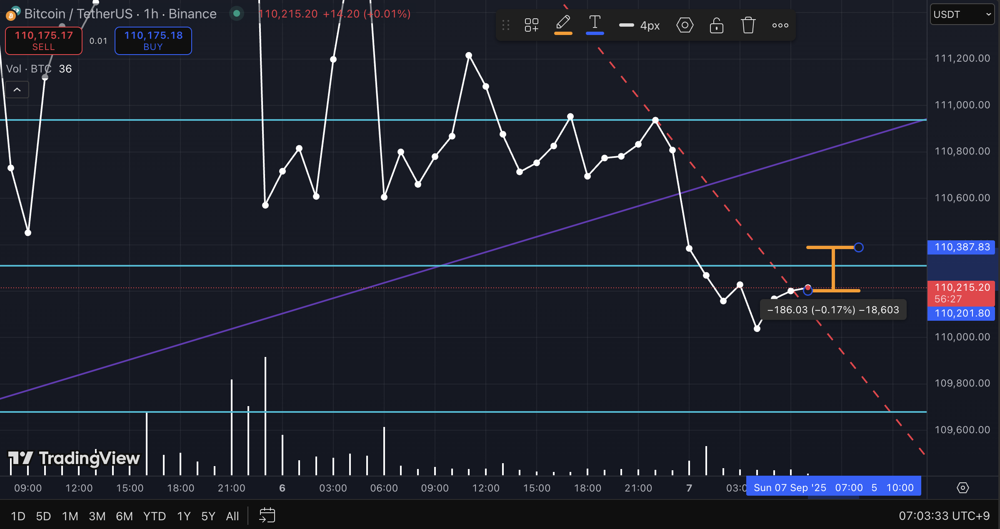

# 2025-09-07_Trend_Reassessment.md

## Chart Analysis: Long-Term Wave B vs. Short-Term Trend Break

---

### 1. Long-Term Perspective
- **Elliott Wave Context**:  
  - In the long run, the **Wave B bullish scenario** remains valid.  
  - A medium-term upward structure is still plausible, but not immediately confirmed.  

---

### 2. Short-Term Observation
- **Trendline break detected** on the recent chart.  
- The short-term market direction **contradicts the bullish scenario**, showing stronger downside pressure.  
- As a result, the **previous long bias is invalidated**, and a reassessment is required.  

---

### 3. Re-Evaluation
- **Position Adjustment**: Shifted to a **short-term bearish outlook**.  
- **Timeframe Adjustment**:  
  - Using higher timeframes (4H, 1D) results in poor risk/reward.  
  - Re-evaluating with the **1H chart** provides a more favorable risk/reward balance for short trades.  

---

### 4. Conclusion
- **Long-term view**: Wave B bullish trajectory is still intact.  
- **Short-term view**: Trendline break favors a bearish setup; long bias invalidated.  
- Current phase should be interpreted as a **“short-term correction within a long-term bullish structure.”**

---

### 5. Result

- Quick profit-taking executed on trendline break  
- Profit: **+0.17%**  
- Position closed immediately upon trendline violation (**strict risk control**)  
- Focus remained on adherence to predefined trading rules, **excluding emotional bias**  
