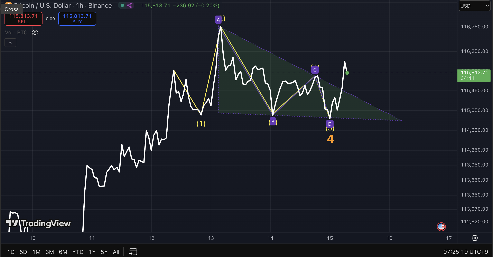
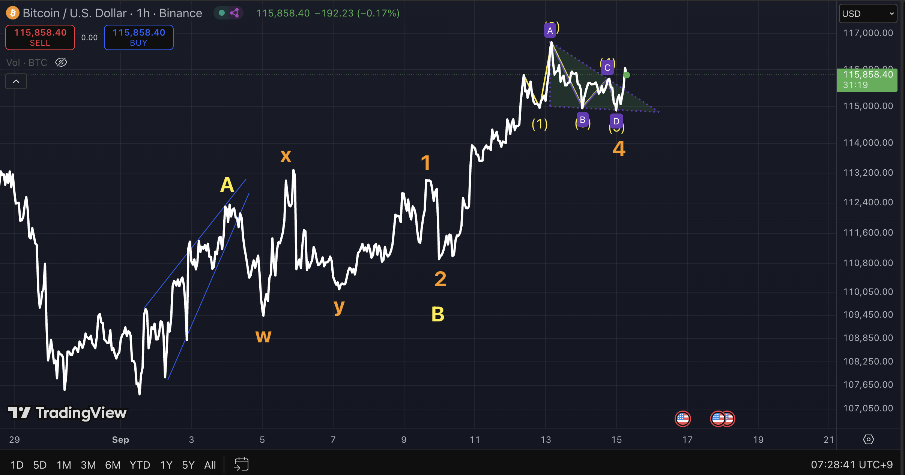
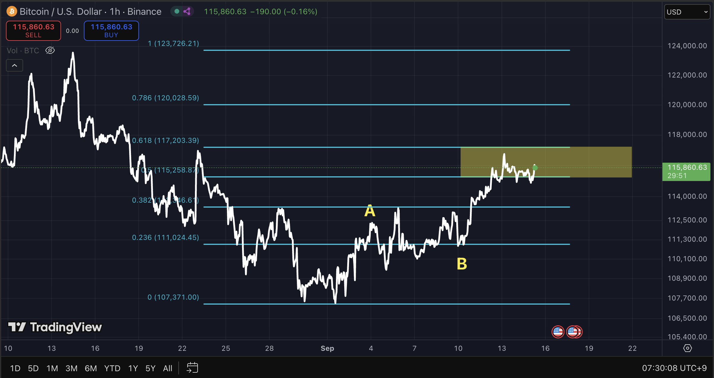
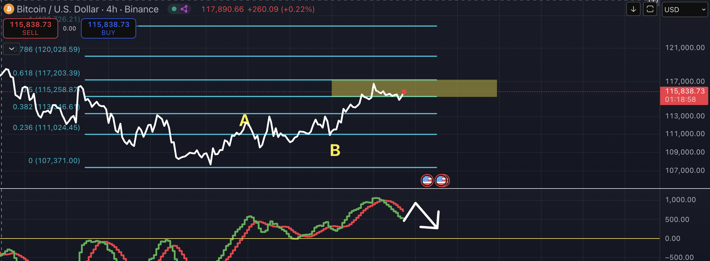
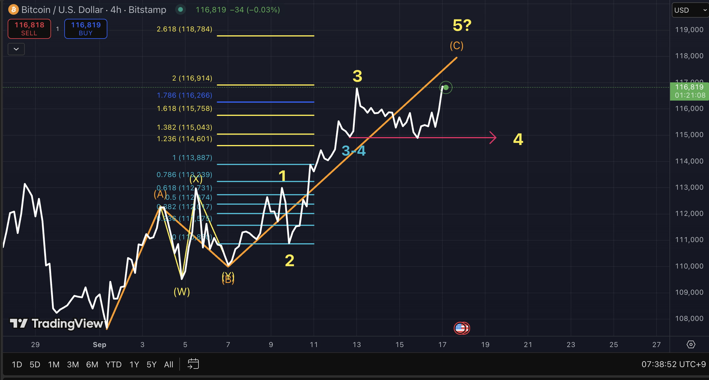
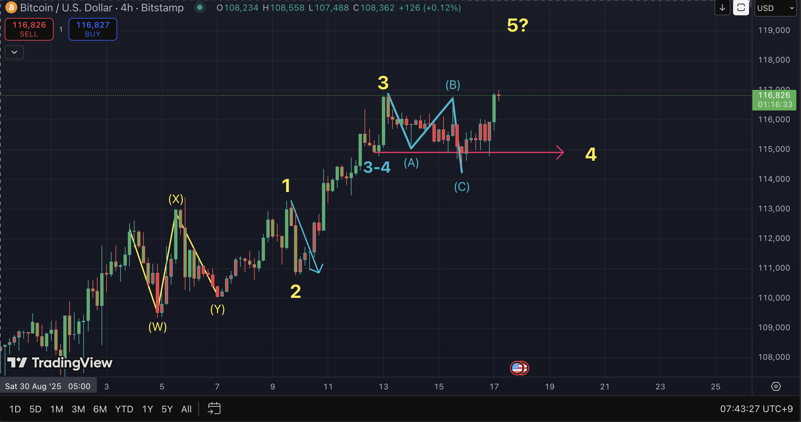
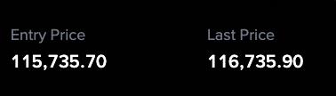

## Objectives  

1. Enhance risk management and strategic decision-making skills under uncertainty  
2. Strengthen deductive, data-driven reasoning by eliminating intuition and emotional bias  
3. Establish a probabilistic thinking framework with consistency and predictive reliability  
4. Study behavioral patterns and decision-making processes of individuals and institutions through market analysis  
5. Advance economic insight and structural understanding  

## 1. Triangle Formation

- The **first chart** shows a **triangle consolidation pattern**, which frequently occurs in **Wave 4**.  

## 2. Projection for Wave 5

- Given the triangle in Wave 4, it is reasonable to anticipate a **downward move in Wave 5**.  
- This aligns with the Elliott Wave principle where a final leg often completes after consolidation.
- The triangle is connected to the **zigzag correction in Wave 2**, forming a **cross pattern** (see orange marking in chart 2).

## 3. Elliott Wave Structure

- In the **second chart**, the movement can be interpreted as an **AB(wxy)C (impulse)** upward sequence.  
- This structure supports the view that the upward move may already be completed.
- The **third chart** shows that from the ABC structure, the retracement falls within the **0.5 ~ 0.618 Fibonacci levels**.  
- This zone strengthens the bearish bias, suggesting a potential decline.

## 4. MACD Divergence on 4H

- The **fourth chart** highlights a potential **MACD bearish divergence** on the 4-hour timeframe.  
- If confirmed, this divergence increases the probability of a **trend reversal to the downside**.  
- Divergences, when aligned with Fibonacci rejection zones, often enhance the reliability of bearish setups.

## 5. External Variable
- A major **variable is the FOMC meeting on September 17**, where a potential **interest rate cut** could influence volatility and trend direction.

---

### Conclusion
- **Primary Bias**: Triangle in Wave 4 (increasing price) → Downward Wave 5 scenario.  
- **Key Levels**: Watch 0.5–0.618 Fibonacci retracement zone.  
- **Risk Factor**: FOMC announcement may disrupt technical patterns.

### Reference
- Frost, A. J., & Prechter, R. R. (2011). Elliott Wave Principle: Key to Market Behavior. Iremedia.
- Bulkowski, T. N. (2018). Chart Patterns: After the Buy. Iremedia.

### Reassessment (17-09-2025)

# Bitcoin Elliott Wave Analysis (4H Chart)

## 1. Wave 4 Low Scenarios (Chart 1)

The potential bottom of Wave 4 can be evaluated using three criteria:

1. **Similar Position to Wave 3–4**
   - Wave 4 often retraces to the same relative area as the prior minor correction (3–4).
2. **Pattern-Based Correction**
   - The structure of the correction itself provides confirmation (zigzag, flat, triangle, or complex).
3. **0.382 Retracement of Wave 3**
   - Statistically, Wave 4 often corrects around the 0.382 Fibonacci retracement of Wave 3.

📌 Based on the current chart, the Wave 4 low is most consistent with the **Wave 3–4 region**.

---

## 2. Wave 2 vs. Wave 4 Relationship (Chart 2)

- **Rule of Alternation:**  
  If Wave 2 is a zigzag, then Wave 4 tends to form as a flat, triangle, or complex structure.
- In the current chart:  
  - **Wave 2:** Zigzag correction  
  - **Wave 4:** Developing as a **flat correction**  

---

## 3. Current Outlook

- With Wave 4 confirmed as a flat correction, the price is now in the **progression of Wave 5**.
- Monitoring Fibonacci extensions and trendline support will be key to validating the completion of this fifth wave.

---

## Summary

- **Wave 4 low:** Best aligned with the Wave 3–4 zone.  
- **Wave 2 vs. Wave 4:** Alternation rule holds (zigzag vs. flat).  
- **Current phase:** Ongoing Wave 5 development.  

