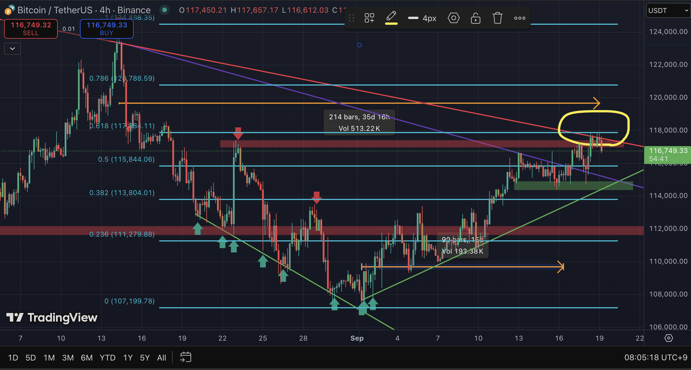
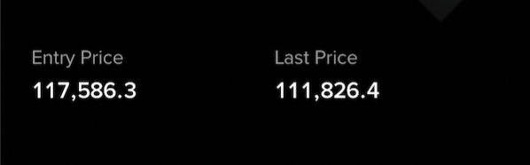
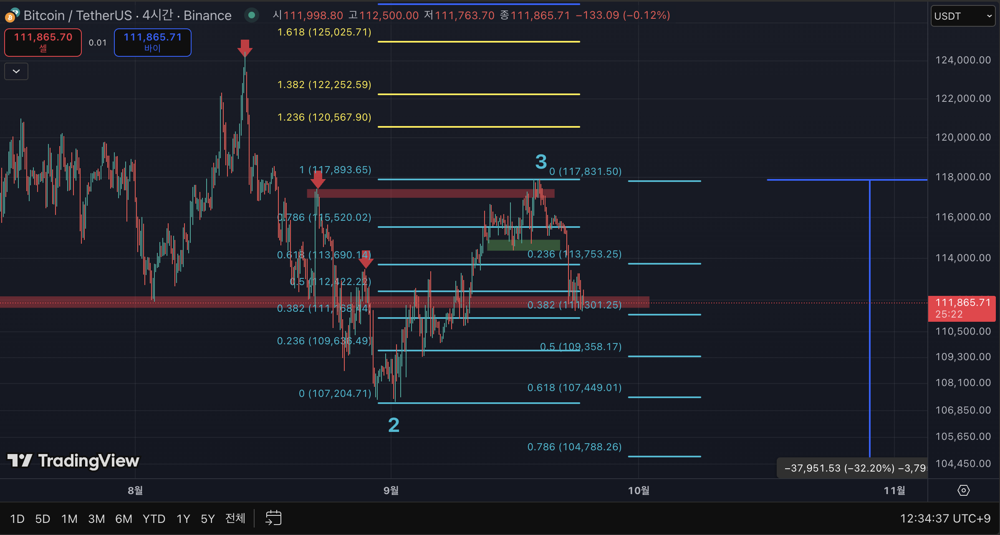
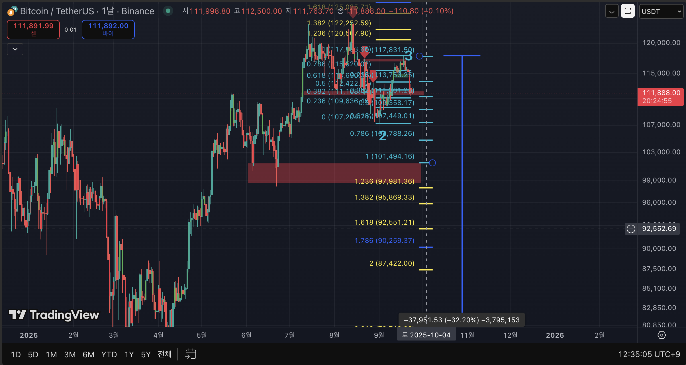

# Bitcoin Wave Analysis (Elliott + Fibonacci)

## 1. Basis of Judgment
- Wave 2 retracement reached **0.681** level, providing the anchor for subsequent wave counts.  
- This level is critical because it defines the balance between correction depth and trend continuation.

## 2. Resistance Zones
- Multiple **supply clusters ** are visible near 117,800–118,000.  
- This zone aligns with prior peaks and coincides with overlapping Fibonacci extensions.  
- Failure to break through this resistance would validate further downside continuation.

## 3. Confirmation Criteria
- **Bearish continuation scenario:** If price breaks **below the Wave 2 low**, sustained decline becomes the primary expectation.

- Target zone based on Fibonacci extension:  
  - **1.618 → 2.618** of Wave 2 (≈ 92,500 → 87,400 USDT).  
- **Bullish invalidation scenario:** If price reclaims and **decisively breaks above the prior high**, the bearish outlook is invalidated.

## 4. Variables
- **Downside:** Sustained rejection at supply zones + break of Wave 2 low → deeper decline.  
- **Upside:** Breakout above previous peak(Skyblue colour No.3) → new bullish wave count required.

---

## References
- **Frost, A. J., & Prechter, R. R. (2011). Elliott Wave Principle: Key to Market Behavior. Iremedia.**
- **Bulkowski, T. N. (2018). Chart Patterns: After the Buy. Iremedia.**
---

## Result

