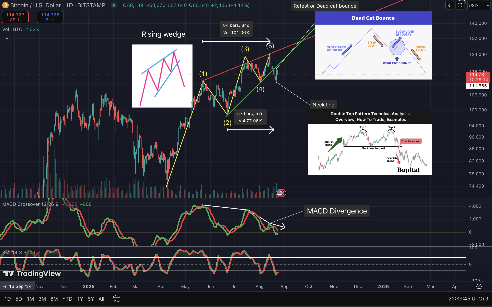

# Daily Chart Analysis (1D)

## Patterns Observed
1. **Rising Wedge**  
   - Potential bearish continuation pattern  
2. **Double Top Formation**  
   - Current structure suggests a possible **retest** and development into a **triple top**  
3. **Dead Cat Bounce Scenario**  
   - Temporary rebound may occur with the possibility of **re-entering the trendline**  
4. **MACD Divergence**  
   - Momentum indicator shows divergence, signaling potential weakening of the current trend  

---

## Interpretation
- The daily chart highlights multiple classical reversal and continuation patterns.  
- The **rising wedge** indicates weakening bullish momentum, raising the likelihood of a bearish breakout.  
- The **double top** with a possible **triple top** reinforces resistance at key neckline levels.  
- The **dead cat bounce** scenario suggests any rebound could be temporary before further downside.  
- The **MACD divergence** confirms imbalance in momentum strength, further supporting the bearish case.  

---

## Reference Literature
1. Frost, A. J., & Prechter, R. R. (2011). *Elliott Wave Principle: Key to Market Behavior*. Iremedia. (Korean edition: 엘리어트 파동이론, 김태훈 역, 이레미디어, 2011)  
2. Bulkowski, T. N. (2018). *Chart Patterns: After the Buy*. Iremedia. (Korean edition: 차트 패턴, 조윤정 역, 이레미디어, 2018)  
3. Murphy, J. J. (1999). *Technical Analysis of the Financial Markets: A Comprehensive Guide to Trading Methods and Applications*. New York Institute of Finance. (Korean edition: 금융시장 기술적 분석, 역서 다수)  

---

## Attached Chart

