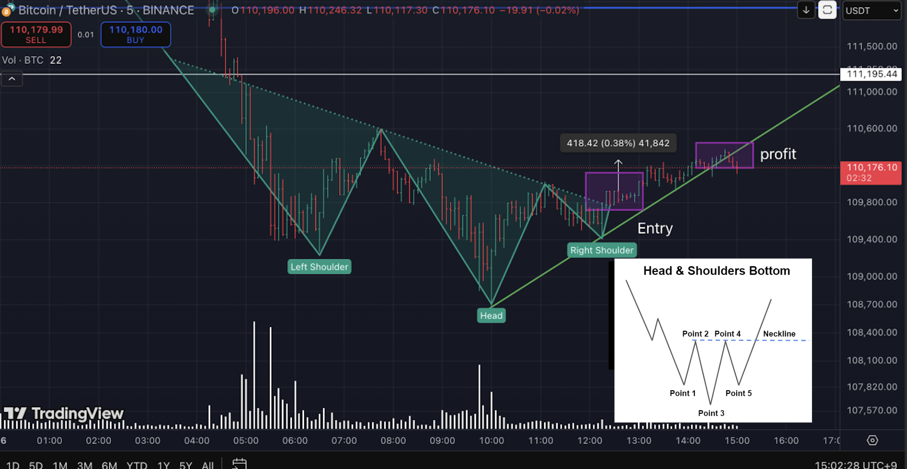
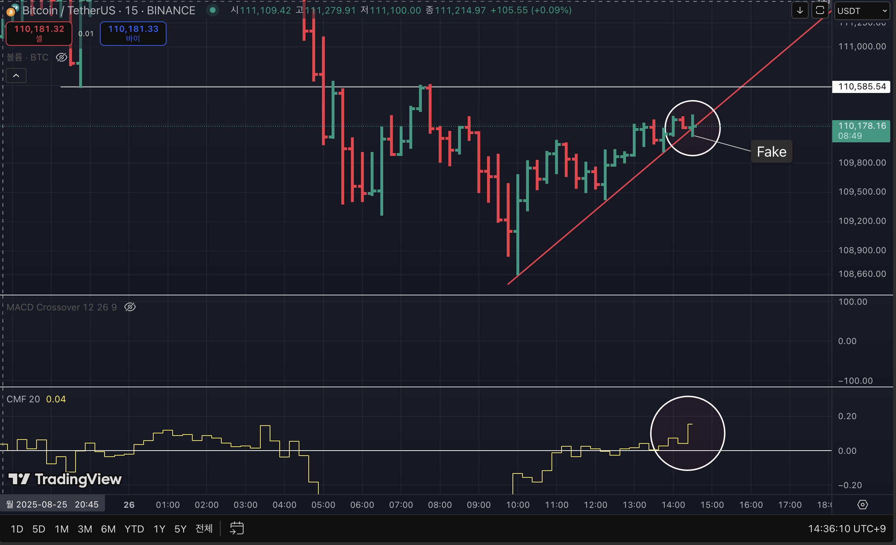

# Chart Analysis (26-08-2025)

## Objectives  

1. Enhance risk management and strategic decision-making skills under uncertainty  
2. Strengthen deductive, data-driven reasoning by eliminating intuition and emotional bias  
3. Establish a probabilistic thinking framework with consistency and predictive reliability  
4. Study behavioral patterns and decision-making processes of individuals and institutions through market analysis  
5. Advance economic insight and structural understanding  

## Patterns Observed
1. **Head and Shoulders (5m Chart)**
   - Clear left shoulder, head, and right shoulder formation
2. **Entry Trigger**
   - Enter position when **neckline breaks**
3. **Exit Strategy**
   - Take profit or stop loss when **trendline is broken**
4. **CMF Divergence**
   - At the moment of trendline break, **CMF shows upward movement**
   - This can be interpreted as a **shakeout move by larger players**

---

## Interpretation
- The 5-minute chart indicates a **short-term reversal pattern** (Head and Shoulders).  
- Neckline break is the **primary entry confirmation**.  
- Trendline break is critical for **risk management** (TP/SL decision).  
- The **CMF upward move** during a bearish setup may imply **liquidity hunt** or **market maker shakeout** before the real move.  

---

## Reference Literature
- Bulkowski, T. N. (2018). *Chart Patterns: After the Buy*. Iremedia.  
  (Korean edition: 차트 패턴, 조윤정 역, 이레미디어, 2018)

---

## Attached Charts
  

