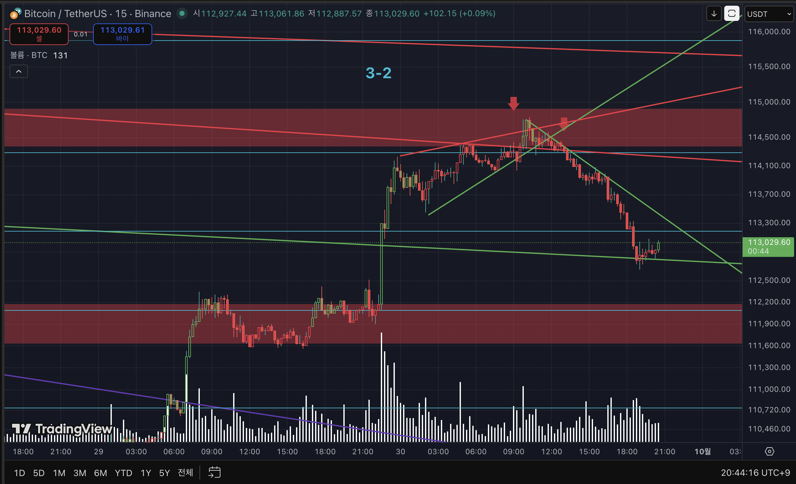
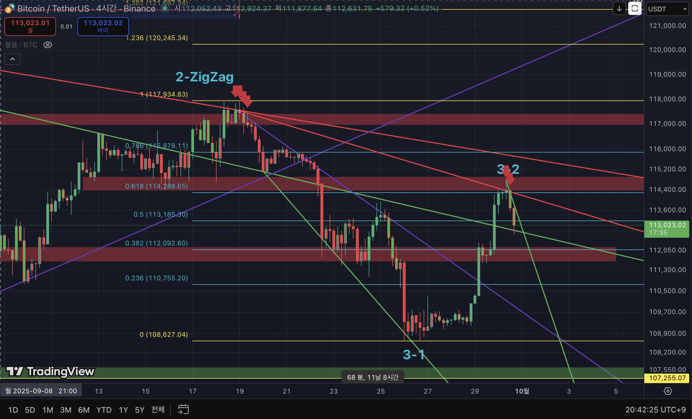

# Bitcoin Wave Analysis (Elliott + Fibonacci)

---

## Chart 1: 15-Min Rising Wedge Pattern  

### Observations
1. **Rising Wedge** pattern formed on the 15-min chart, followed by ~1% decline **without breaking trendline support**.  
2. After the drop, a **short-term rebound** is in progress along the same trendline.  

---

## Chart 2: 4H Wave Count & Fibonacci Retracement  

### Observations
1. Within the larger structure, the price has **reversed from the 0.618 retracement**, suggesting a potential **C-3-2 corrective wave**.  
2. Entry consideration: Current rejection is weak → **low reliability** due to limited **retest of the trendline**. Safer entry would be after confirmation of resistance at the trendline.  
3. Notably, **C-3-1 unfolded as an extended third wave**, indicating irregular momentum between buyers and sellers (lack of one-sided continuation).  

---

## Summary
- **Short-term (15m):** Rising wedge breakdown with ~1% move, minor rebound ongoing.  
- **Mid-term (4h):** Market leaning toward C-3-2 bearish scenario, but confirmation required at trendline retest.  
- **Bias:** Bearish continuation is favored unless strong breakout occurs above resistance zones.  

---

## References
- Frost, A. J., & Prechter, R. R. (2011). *Elliott Wave Principle: Key to Market Behavior*. Iremedia.  
- Bulkowski, T. N. (2018). *Chart Patterns: After the Buy*. Iremedia.  
