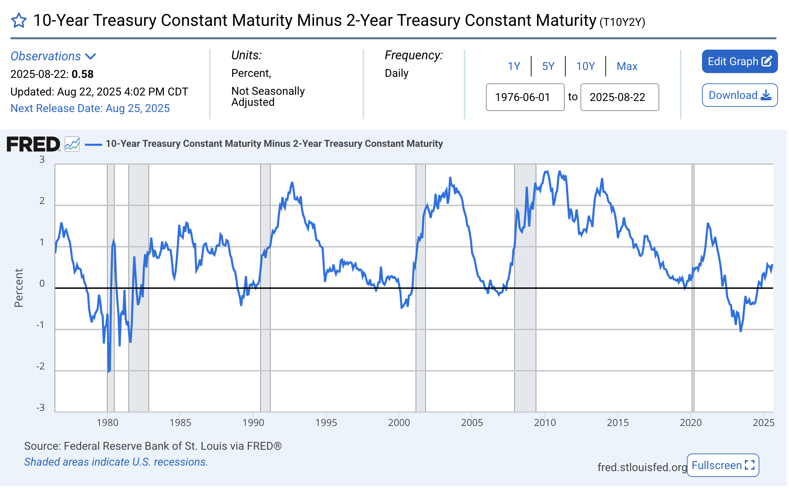
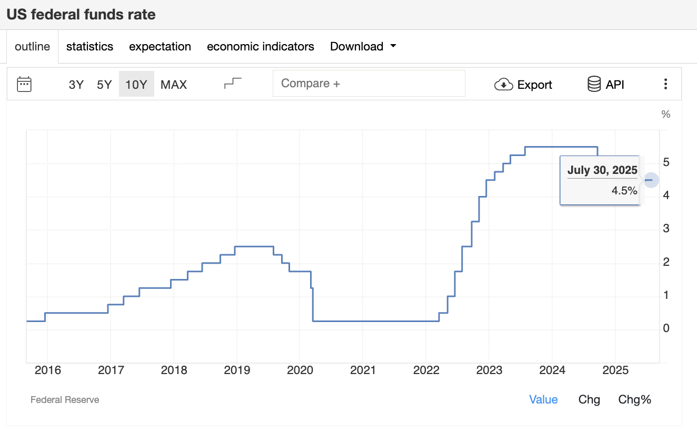

# 10-Year Minus 2-Year Treasury Yield Spread (T10Y2Y)

This document analyzes the historical spread between the 10-year and 2-year U.S. Treasury yields, focusing on its role as a recession indicator and the Federal Reserve’s policy response.

---

## Yield Spread Chart

**Source:** Federal Reserve Bank of St. Louis (FRED), *10-Year Treasury Constant Maturity Minus 2-Year Treasury Constant Maturity (T10Y2Y)*

---

## Recession Shading and Key Insights

The shaded gray areas on the chart represent official U.S. recession periods as defined by the National Bureau of Economic Research (NBER).  
A negative yield spread (inversion) has historically preceded recessions by several months to over a year.

### Recession Periods and Fed Responses

| Recession Period       | Description & Events                                                   | Fed Policy Response                          |
|------------------------|------------------------------------------------------------------------|-----------------------------------------------|
| Early 1980s Recession  | High inflation → Volcker’s tight monetary policy; inversion preceded downturn | Fed started **cutting rates** late 1981         |
| 1990–91 Recession      | Real estate collapse, bank stress, and elevated rates                  | Fed implemented **gradual rate cuts**         |
| 2001 Recession         | Dot-com bust + 9/11 terrorist attacks                                 | Fed responded with **immediate rate reductions** |
| Great Recession (2007–09) | Housing bubble burst leading to global financial crisis             | Fed moved to **zero interest rates + QE**      |
| COVID-19 Recession (2020) | Pandemic-induced global lockdowns                                   | Fed enacted **emergency cuts and liquidity support** |

---

## Supporting Charts

### U.S. Federal Funds Rate
  
**Source:** Federal Reserve

### U.S. Treasury Yields (August 2025)
  
**Source:** U.S. Treasury Market Data

---

## Interpretative Summary

- The **10-2 yield spread inversion** has consistently preceded U.S. recessions, making it one of the most reliable early-warning indicators.  
- Recent prolonged inversion since 2022 marks a record in duration but has not yet been followed by a deep recession.  
- Historically, the **return to positive spreads (disinversion)** often coincides with the actual onset of recessions.  
- While highly reliable, the indicator should be interpreted alongside broader macroeconomic and financial conditions.  

---

## Suggested Citation
Federal Reserve Bank of St. Louis, *10-Year Treasury Constant Maturity Minus 2-Year Treasury Constant Maturity (T10Y2Y)*, retrieved from FRED: https://fred.stlouisfed.org/series/T10Y2Y  
Federal Reserve, *Federal Funds Rate Data*  
U.S. Treasury, *Market Yield Data*
